# Architecture & System Design Document

**Project:** AI-Powered Smart Farming  
**Version:** 1.0  
**Date:** September 2026  
**Status:** Active / Production Reference  

---

## Table of Contents

1. [System Overview](#1-system-overview)
2. [High-Level Architecture](#2-high-level-architecture)
3. [Layer Breakdown](#3-layer-breakdown)
   - 3.1 [Client Layer](#31-client-layer)
   - 3.2 [API Gateway](#32-api-gateway)
   - 3.3 [Async Job Queue](#33-async-job-queue)
   - 3.4 [ML Pipeline](#34-ml-pipeline)
   - 3.5 [Persistence Layer](#35-persistence-layer)
4. [Service Boundaries](#4-service-boundaries)
   - 4.1 [FastAPI Application](#41-fastapi-application)
   - 4.2 [Pipeline Orchestrator](#42-pipeline-orchestrator)
   - 4.3 [Shared Pipeline Context](#43-shared-pipeline-context)
   - 4.4 [Storage Abstraction Layer](#44-storage-abstraction-layer)
5. [Data Models](#5-data-models)
6. [Authentication & Authorization](#6-authentication--authorization)
7. [Data Flow: Scan & Predict](#7-data-flow-scan--predict)
8. [Expert Review Flow](#8-expert-review-flow)
9. [Scheduler & Background Jobs](#9-scheduler--background-jobs)
10. [Frontend Architecture](#10-frontend-architecture)
11. [Infrastructure & Deployment](#11-infrastructure--deployment)
12. [Non-Functional Characteristics](#12-non-functional-characteristics)

---

## 1. System Overview

**AI-Powered Smart Farming** is a full-stack, production-grade crop disease diagnostic platform built for Indian farmers. A farmer photographs a diseased leaf using their mobile device; within seconds the platform identifies the crop, classifies the disease, estimates severity, detects pests, factors in live weather conditions, and delivers actionable treatment recommendations in the farmer's preferred language (English, Hindi, or Gujarati).

The system is architected around four core tenets:

| Tenet | Implementation |
|---|---|
| **Accuracy** | Multi-model ensemble (EfficientNet-B0 → B2 → YOLOv8) with uncertainty escalation to human experts |
| **Serverless Scalability** | Decoupled microservices on Google Cloud Run scaling to zero (512MiB API Gateway + 2GiB Inference Service) |
| **Traceability** | Every prediction carries a `provenance` block capturing exact model versions, config hash, and pipeline timing |
| **Extensibility** | Config-driven model routing, hot-reload support, storage-agnostic interface (GCS/S3/local), and built-in MLOps |

---

## 2. High-Level Architecture

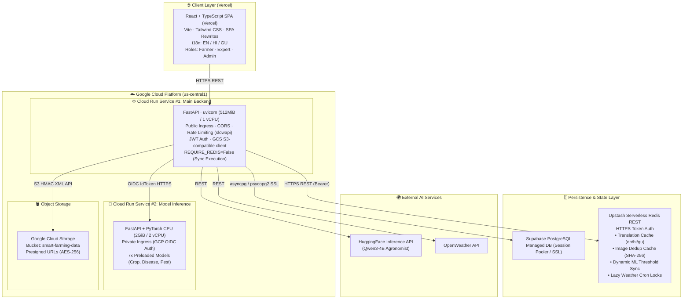

---

## 3. Layer Breakdown

### 3.1 Client Layer

| Property | Detail |
|---|---|
| **Framework** | React 18 + TypeScript, bundled with Vite |
| **Styling** | Tailwind CSS utility classes + custom UI component library |
| **Routing** | React Router v6 (client-side, SPA) |
| **State** | `AuthContext` (JWT + profile); local component state |
| **HTTP Client** | Axios with Bearer token injection interceptor |
| **Real-time** | Native WebSocket API for live pipeline progress |
| **i18n** | Three-locale support — English, Hindi (`hi`), Gujarati (`gu`) |
| **Roles** | `farmer` · `expert` · `admin` (route-level guards) |

### 3.2 API Gateway

The FastAPI application is the single ingress for all client traffic.

| Concern | Mechanism |
|---|---|
| **Concurrency** | `uvicorn` ASGI server; async request handlers |
| **CORS** | Configurable allowed origins via middleware |
| **Rate Limiting** | `slowapi` (token-bucket per IP/user) |
| **Auth** | JWT HS256 Bearer tokens; `HttpOnly` refresh cookie |
| **Static Files** | `/data` → `backend/data/` (processed images, exports) |
| **Lifespan** | DB init, ARQ pool init, APScheduler start, weather cron bootstrap |

### 3.3 Execution Model & Job Queue

The platform supports two deployment execution modes depending on infrastructure constraints:

#### Mode A: Serverless Synchronous Microservices (Cloud Run Production — Active)
In Cloud Run, persistent background polling workers (like ARQ) would consume the entire monthly Always Free quota in ~2 days. To allow both services to scale to **0 instances** when idle, `REQUIRE_REDIS=False` is set:
1. `POST /predict` receives the leaf upload.
2. An image SHA-256 hash check consults **Upstash Serverless Redis REST** (`sf:dedup:{hash}`). If a duplicate prediction exists within 24 hours, the cached result is returned immediately in under 20ms.
3. Synchronous validation & quality pre-checks run immediately.
4. The image is saved to **Google Cloud Storage** (`smart-farming-data`) via S3 HMAC XML API.
5. Main Backend invokes **Cloud Run Service #2 (`inference-service`)** synchronously over HTTPS using GCP OIDC Identity Tokens.
6. Weather enrichment and LLM advisory recommendations are generated.
7. FastAPI `BackgroundTasks` automatically pre-translates the advisory into Hindi (`hi`) and Gujarati (`gu`), populating Upstash Redis REST cache (`sf:trans:{lang}:{hash}`) asynchronously without holding up the HTTP response.
8. The full prediction result, provenance block, and GCS presigned URLs are committed to Supabase PostgreSQL and returned in the HTTP response.

#### Mode B: Asynchronous Queue (Dedicated Host / Local Development)
When Redis is provisioned and `REQUIRE_REDIS=True`:

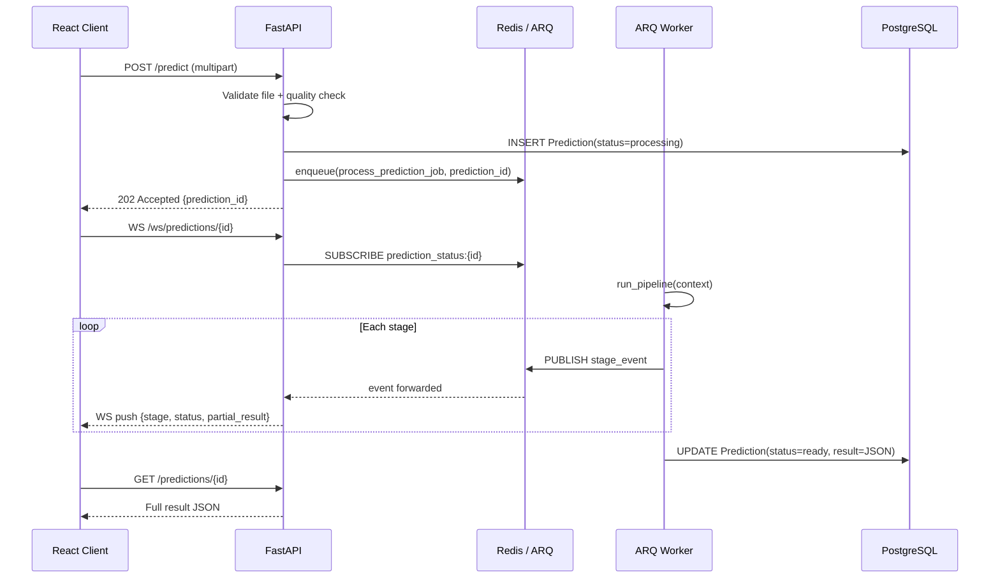

- **Prediction lifecycle:** `processing` → `ready` | `failed` | `pending_expert_review` → `verified` | `rescan_requested`

### 3.4 ML Pipeline

The pipeline is a linear, context-passing chain of 8 specialised stages. In production, Stages 1 through 6 run inside **Service #2 (`inference-service`)**, while Weather (Stage 7) and LLM Recommendation (Stage 8) are coordinated by **Service #1 (`smart-farming-backend`)**.

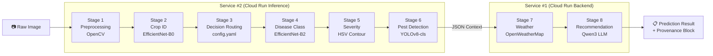

| Stage | Model / Tool | Output Written to Context |
|---|---|---|
| **1 · Preprocessing** | OpenCV (blur, brightness, leaf mask) | `image.processed_path`, `quality_score`, `blur_score`, `leaf_detected` |
| **2 · Crop Identification** | EfficientNet-B0 | `crop.label`, `crop.confidence`, `crop.uncertainty`, `crop.is_uncertain` |
| **3 · Decision Routing** | `config.yaml` lookup | Selects per-crop disease model; sets `crop.status` |
| **4 · Disease Classification** | EfficientNet-B2 (per-crop) | `disease.label`, `disease.confidence`, `disease.all_probs`, `disease.escalation_required` |
| **5 · Severity Estimation** | HSV contour heuristic | `severity.percent`, `severity.bucket` (Mild / Moderate / Severe) |
| **6 · Pest Detection** | YOLOv8-cls | `pests[{label, confidence}]`, `pest_classification` |
| **7 · Weather Enrichment** | OpenWeatherMap REST API | `weather.{temperature, humidity, wind_speed, condition}` |
| **8 · Recommendation** | Qwen3 (HuggingFace / nscale) | `recommendation.{immediate_action, treatment, prevention, monitoring}` |

> [!NOTE]
> Stage 3 (Decision Routing) allows per-crop model overrides. If a specialised EfficientNet-B2 model is registered for the detected crop in `config.yaml`, it is used; otherwise a generalist model handles classification. This makes adding new crop models purely a configuration change — no code deploy required.

### 3.5 Persistence Layer

| Store | Purpose | Implementation |
|---|---|---|
| **Relational DB** | All structured data (users, farms, predictions, feedback) | Supabase PostgreSQL (`sslmode=require`) · SQLite (dev/test) |
| **Object Store** | Raw uploads, processed images, audio files | Google Cloud Storage (`smart-farming-data` via S3 HMAC API) · AWS S3 · Local |
| **Serverless Cache & State** | Sub-20ms translation caching, prediction dedup, dynamic thresholds, weather caching & lazy cron locks | Upstash Serverless Redis REST (`UPSTASH_REDIS_REST_URL` via HTTPS token auth) |

The storage interface (`storage.py`) is fully abstracted — switching between `local`, `gcs`, or `s3` backends is a single environment variable change (`STORAGE_BACKEND`).

---

## 4. Service Boundaries

### 4.1 FastAPI Application

**Entry point:** `backend/src/app/main.py`

Responsibilities:
- Wires all API routers (`/auth`, `/predict`, `/predictions`, `/farms`, `/expert`, `/admin`, `/ws`, `/config`)
- Registers lifespan hooks: DB initialisation → ARQ pool creation → APScheduler start → weather cron bootstrap
- Applies middleware stack: CORS → rate limiter → request ID injection
- Mounts `backend/data/` at `/data` for static file serving (processed images, exports)

### 4.2 Pipeline Orchestrator

**File:** `backend/src/app/pipeline.py`

```python
# Public interface
run_pipeline(context: dict) -> dict
reload_config()                          # Hot-reloads config.yaml + preprocessor
```

Internally, every stage is wrapped by `_exec_stage(name, fn, context)` which:
1. Records `started_at` timestamp
2. Calls the stage function
3. Records `completed_at` and `duration_ms`
4. Sets `context["status"][stage_name]` to `"completed"` or `"failed"`
5. Appends non-fatal warnings to `context["notes"]`

After all stages complete, `build_provenance(context)` constructs a metadata block that is attached to the prediction result for full traceability.

### 4.3 Shared Pipeline Context

Every pipeline run is driven by a single mutable `context` dict that flows through all 8 stages. Its schema is defined in `backend/src/app/context.py`:

```python
{
  # Identity
  "request_id": str,           # UUID for this pipeline run

  # Input
  "user": {
    "user_id": str,
    "location": str,
    "lat": float, "lon": float,
    "language": str             # "en" | "hi" | "gu"
  },

  # Image processing outputs
  "image": {
    "raw_path": str,
    "processed_path": str,
    "leaf_crop": np.ndarray,   # Cropped leaf region
    "quality_score": float,
    "blur_score": float,
    "brightness_score": float,
    "leaf_detected": bool
  },

  # Crop identification outputs
  "crop": {
    "label": str, "confidence": float,
    "model_name": str, "model_version": str,
    "confidence_rating": str,  # "High" | "Medium" | "Low"
    "uncertainty": float, "is_uncertain": bool,
    "status": str
  },

  # Disease classification outputs
  "disease": {
    "label": str, "confidence": float,
    "all_probs": dict,
    "model_used": str, "model_name": str,
    "confidence_rating": str,
    "uncertainty": float, "is_uncertain": bool,
    "escalation_required": bool
  },

  # Severity estimation outputs
  "severity": {
    "percent": float,
    "affected_area": float,
    "bucket": str,             # "Mild" | "Moderate" | "Severe"
    "quality_flag": str
  },

  # Pest detection outputs
  "pests": [{"label": str, "confidence": float}],
  "pest_classification": {
    "model_type": str, "model_used": str,
    "top_k": int, "all_probs": dict,
    "available": bool, "status": str
  },

  # Weather enrichment outputs
  "weather": {
    "temperature_celsius": float,
    "humidity_percent": float,
    "pressure_hpa": float,
    "wind_speed_m_s": float,
    "condition": str, "description": str
  },

  # LLM recommendation outputs
  "recommendation": {
    "immediate_action": str,
    "treatment": str,
    "prevention": str,
    "monitoring": str,
    "provider": str, "model": str,
    "is_fallback": bool
  },

  # Pipeline metadata
  "notes": [str],              # Non-fatal warnings from any stage
  "stages": {
    "<stage_name>": {
      "status": str,
      "started_at": str,
      "completed_at": str,
      "duration_ms": int
    }
  },
  "status": { ... },           # Per-stage status shorthand
  "provenance": {
    "schema_version": str,
    "config": dict,
    "models": dict,
    "weather_provider": str,
    "recommendation_provider": str,
    "pipeline_duration_ms": int,
    "generated_at": str        # ISO 8601
  }
}
```

### 4.4 Storage Abstraction Layer

**File:** `backend/src/app/core/storage.py`

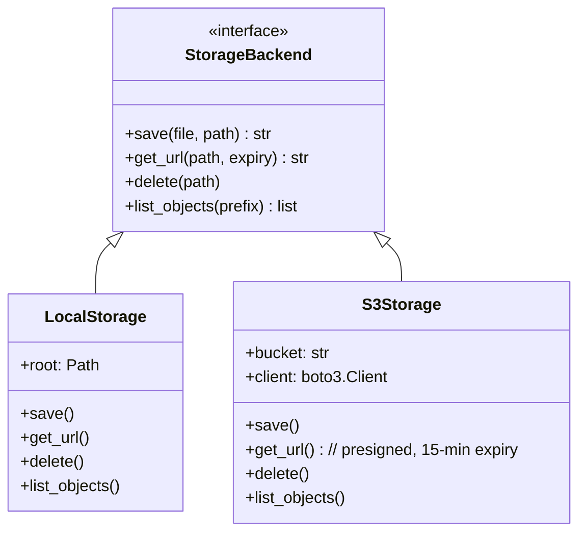

| Backend | `STORAGE_BACKEND` value | URL type |
|---|---|---|
| Local filesystem | `local` | Relative path under `/data` static mount |
| AWS S3 / MinIO | `s3` | Presigned URL (15-minute expiry) |

---

## 5. Data Models

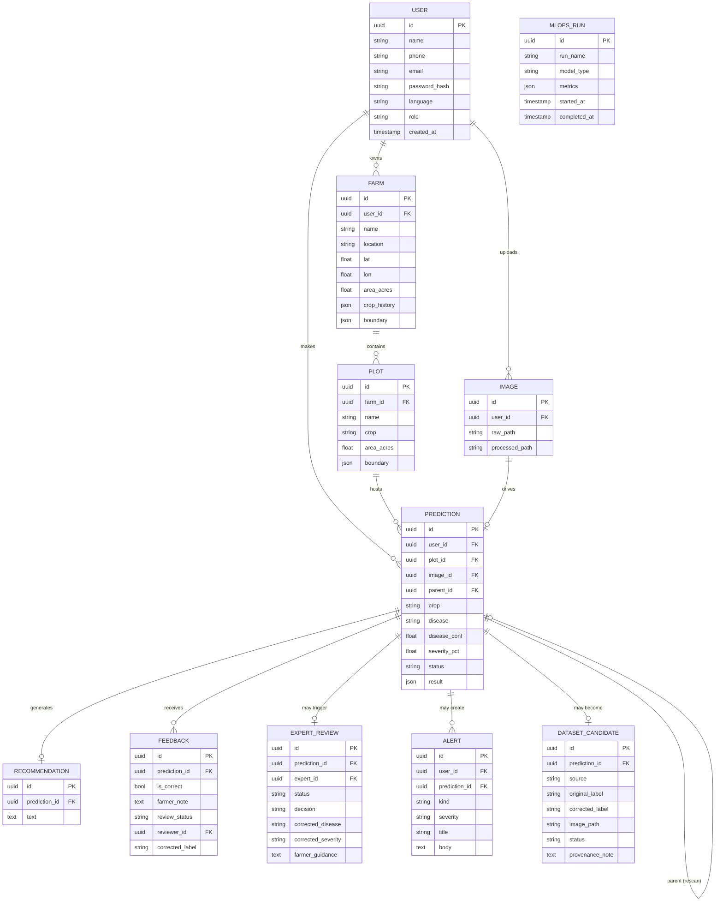

---

## 6. Authentication & Authorization

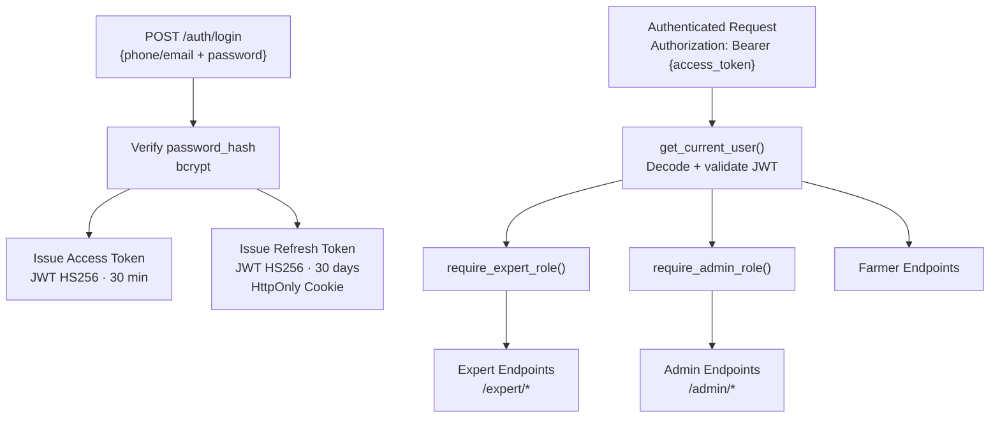

| Token | Algorithm | Lifetime | Transport |
|---|---|---|---|
| Access Token | HS256 JWT | 30 minutes | `Authorization: Bearer` header |
| Refresh Token | HS256 JWT | 30 days | `HttpOnly` cookie (SameSite=Strict) |

**Role hierarchy:**

```
admin  ⊃  expert  ⊃  farmer
```

Each role inherits permissions from the roles below it. Role checks are applied via FastAPI `Depends()` injection at the router level.

---

## 7. Data Flow: Scan & Predict

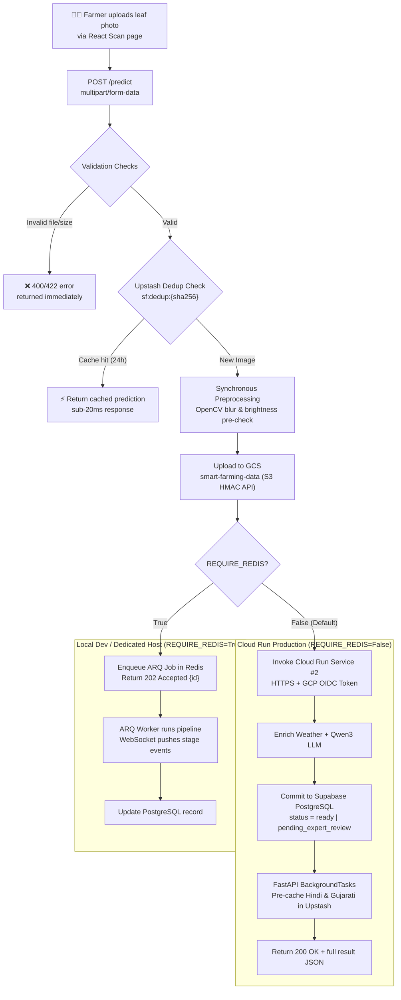

**Validation checks at `POST /predict`:**

1. MIME type whitelist (`image/jpeg`, `image/png`, `image/webp`)
2. File size limit (configurable, default 10 MB)
3. Magic byte verification (prevents spoofed content-type)
4. SHA-256 hash deduplication per `(user_id, plot_id)`
5. Synchronous OpenCV blur + brightness pre-check (rejects unusable images fast)

---

## 8. Expert Review Flow

Low-confidence predictions are automatically escalated to the expert queue rather than being silently served to farmers.

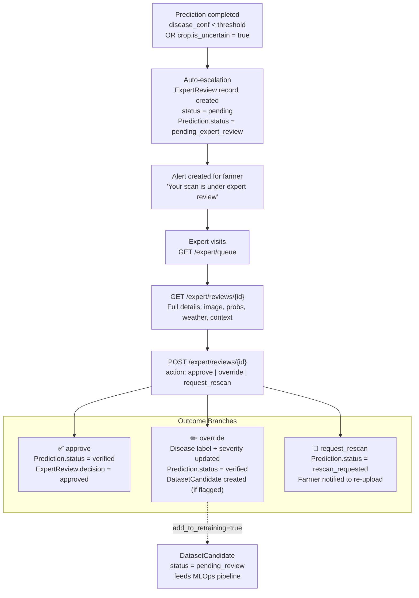

> [!IMPORTANT]
> Expert overrides that are flagged for retraining feed the `DatasetCandidate` table, which serves as the ground-truth curation mechanism for future model fine-tuning cycles tracked in `MLOpsRun`.

---

## 9. Scheduler & Background Jobs

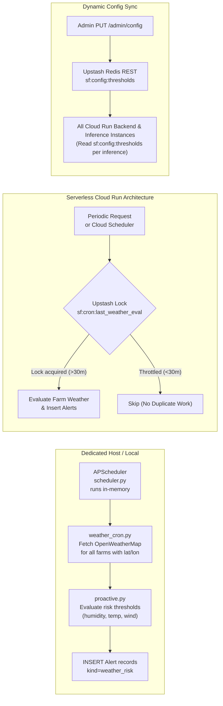

| Job / Mechanism | Trigger | Implementation / Purpose |
|---|---|---|
| `weather_cron` | Every 30 min (APScheduler / Request) | Proactively fetches weather for all registered farms, cached in Upstash Redis REST (`sf:weather:{lat}:{lon}`) for 30 minutes |
| `proactive_alerts` | After each `weather_cron` | Evaluates agronomic thresholds and inserts `Alert` records into Supabase PostgreSQL |
| `serverless_cron_lock` | Upstash Redis REST | Atomically manages `sf:cron:last_weather_eval` timestamp to prevent duplicate alert evaluations across autoscaled instances |
| `dynamic_threshold_sync` | Admin `PUT /admin/config` | Updates `sf:config:thresholds` in Upstash Redis REST, allowing all Cloud Run instances to instantly pick up threshold changes without worker restarts |

---

## 10. Frontend Architecture

### Page Inventory

| Page | Role Access | Description |
|---|---|---|
| `Landing` | Public | Marketing / intro page |
| `Login` / `Register` | Public | Auth forms |
| `Dashboard` | Farmer+ | Overview: recent scans, alerts, weather |
| `Scan` | Farmer+ | Upload leaf photo, start prediction |
| `Processing` | Farmer+ | Live WebSocket progress view |
| `PredictionResult` | Farmer+ | Full result: disease, severity, pests, recommendation |
| `History` | Farmer+ | Past predictions with filter/search |
| `Alerts` | Farmer+ | Notification centre (disease + weather) |
| `Weather` | Farmer+ | Farm weather dashboard |
| `FarmSettings` / `Crops` | Farmer+ | Farm and plot management |
| `Settings` / `About` / `Services` | Farmer+ | Profile, app info |
| `ExpertQueue` | Expert+ | List of pending expert review items |
| `ExpertReview` | Expert+ | Detailed review and action form |
| `AdminMetrics` | Admin | System-wide ML and usage metrics |
| `AdminUsers` | Admin | User management |
| `AdminFeedback` | Admin | Farmer feedback moderation |

### Component Architecture

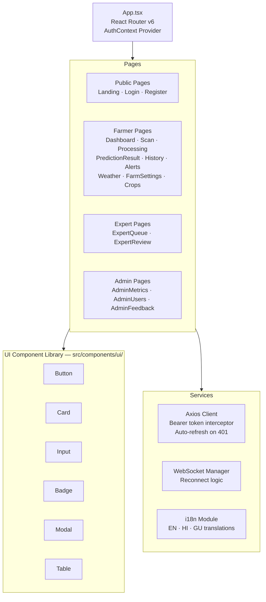

### i18n Strategy

All user-visible strings are loaded from locale JSON files. The active locale is stored in `AuthContext` alongside the user profile (language preference persisted to the user record in the DB). Locale switching requires no page reload.

---

## 11. Infrastructure & Deployment

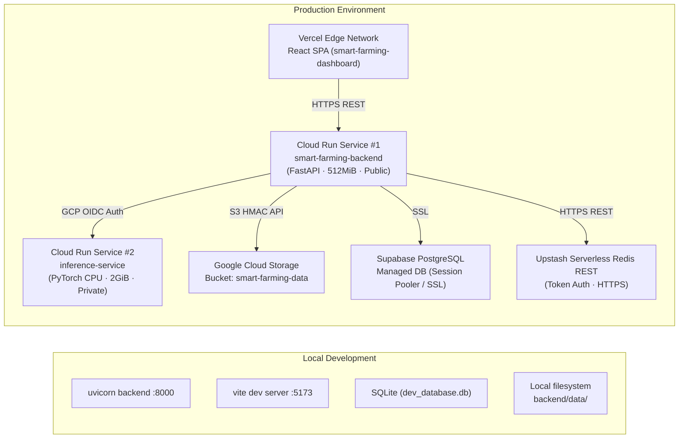

### Environment Configuration (Production Cloud Run)

| Variable | Value / Purpose |
|---|---|
| `DATABASE_URL` | Supabase PostgreSQL DSN (`postgresql://postgres.<PROJECT_REF>:<DB_PASSWORD>@aws-0-<REGION>.pooler.supabase.com:5432/postgres?sslmode=require`) |
| `STORAGE_BACKEND` | `gcs` (Google Cloud Storage) |
| `AWS_ACCESS_KEY_ID` | GCS HMAC Access ID (`<YOUR_GCS_HMAC_ACCESS_KEY>`) |
| `AWS_SECRET_ACCESS_KEY` | GCS HMAC Secret Key (`<YOUR_GCS_HMAC_SECRET_KEY>`) |
| `AWS_REGION` | `auto` |
| `AWS_S3_BUCKET` | `smart-farming-data` |
| `AWS_ENDPOINT_URL` | `https://storage.googleapis.com` |
| `MODEL_SERVER_URL` | Cloud Run Service #2 URL (`https://inference-service-<PROJECT_HASH>.<REGION>.run.app`) |
| `UPSTASH_REDIS_REST_URL` | Upstash Serverless Redis REST URL (`https://<YOUR_UPSTASH_DB_NAME>.upstash.io`) |
| `UPSTASH_REDIS_REST_TOKEN` | Upstash Serverless Redis REST Bearer Token (`<YOUR_UPSTASH_REST_TOKEN>`) |
| `REQUIRE_REDIS` | `False` (bypasses persistent worker polling; enables true scale-to-zero) |
| `JWT_SECRET_KEY` | Production JWT signing key (HS256) |
| `OPENWEATHER_API` | OpenWeatherMap API key |
| `HF_TOKEN` | HuggingFace Inference API token (Qwen3-4B Agronomist) |
| `CORS_ORIGINS` | `https://smart-farming-dashboard.vercel.app,http://localhost:5173` |

---

## 12. Non-Functional Characteristics

### Reliability

- **Graceful degradation:** Each pipeline stage is independently fenced. A failed weather or LLM stage does not abort the prediction — it marks that stage as failed and continues, serving a partial result with `is_fallback: true` where applicable.
- **Expert escalation:** Uncertain predictions are never silently downgraded — they are held for human review.
- **Deduplication:** SHA-256 hash check consults Upstash Redis REST (`sf:dedup:{hash}`) to return cached results in <20ms, preventing redundant compute on identical uploads.

### Performance

- **Serverless Zero-Idle Latency:** Main backend routes inference synchronously to `inference-service` via private HTTPS, scaling to zero when idle while achieving fast execution (~1.5s–3s cold start, sub-500ms warm).
- **Sub-20ms Translation Caching:** Multilingual advisory translations (Hindi, Gujarati) are pre-cached in Upstash Redis REST via FastAPI `BackgroundTasks`, delivering instant response times on language toggles.
- **Stage timing:** Every stage records `duration_ms`, enabling per-stage bottleneck analysis via the provenance block.
- **Dynamic Config Sync:** Model thresholds (`sf:config:thresholds`) are synced across all Cloud Run instances via Upstash Redis REST with zero downtime and without requiring server restarts.

### Observability

- **Provenance block:** Every prediction result carries exact model versions, config hash, all stage timings, and LLM provider info. Full audit trail for any inference.
- **Pipeline notes:** Non-fatal warnings (e.g., low image quality, uncertain crop) are appended to `context["notes"]` and surfaced in the result.
- **MLOps loop:** Expert-corrected labels flow into `DatasetCandidate` → `MLOpsRun` tables, enabling a closed retraining feedback loop.

### Security

- Short-lived access tokens (30 min) with `HttpOnly` refresh cookies prevent XSS token theft.
- Rate limiting (slowapi) protects inference endpoints from abuse.
- Magic-byte file validation prevents content-type spoofing on uploads.
- Presigned S3 URLs (15-min expiry) enforce time-bounded image access.
- Private Cloud Run Ingress ensures `inference-service` is accessible only via authenticated GCP OIDC identity tokens from the backend.

### Scalability

- Cloud Run instances scale automatically from 0 up to configured maximum instances based on incoming request concurrency.
- Storage backend is swappable (local → GCS/S3) without code changes.
- Persistence is fully managed via Supabase PostgreSQL (with connection pooling) and Upstash Serverless Redis REST (stateless HTTPS connections).

---

*AI-Powered Smart Farming — Documentation*  
*Last Updated: September 2026*
