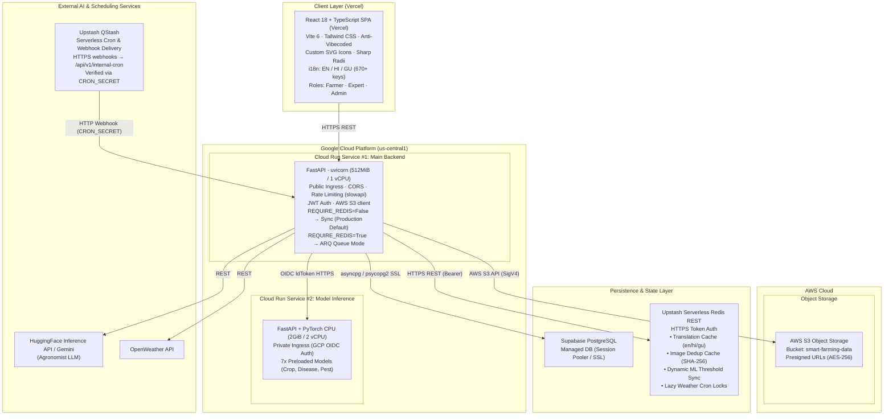
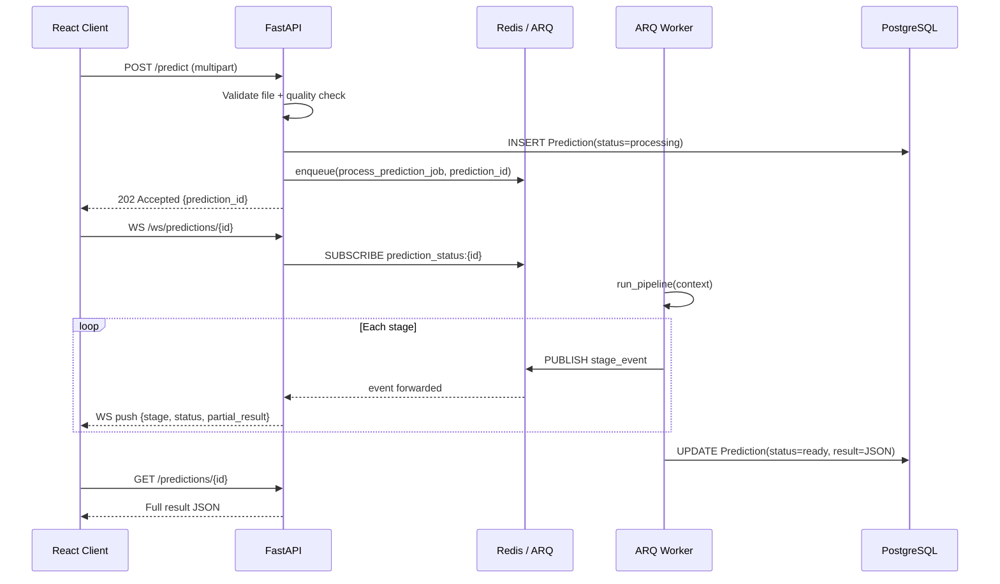
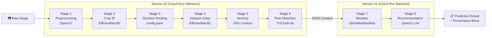
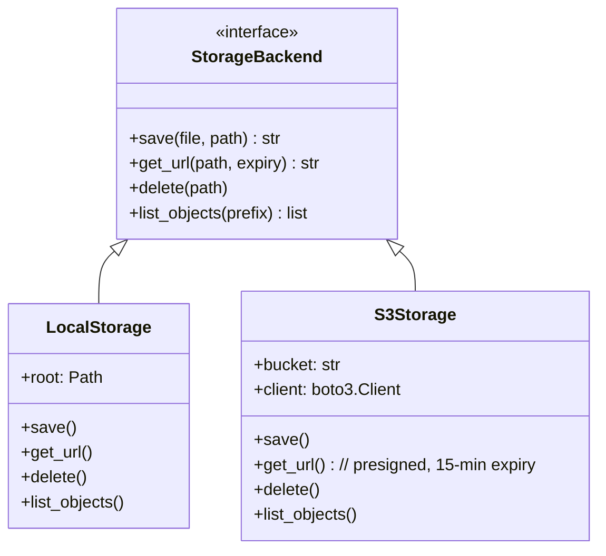
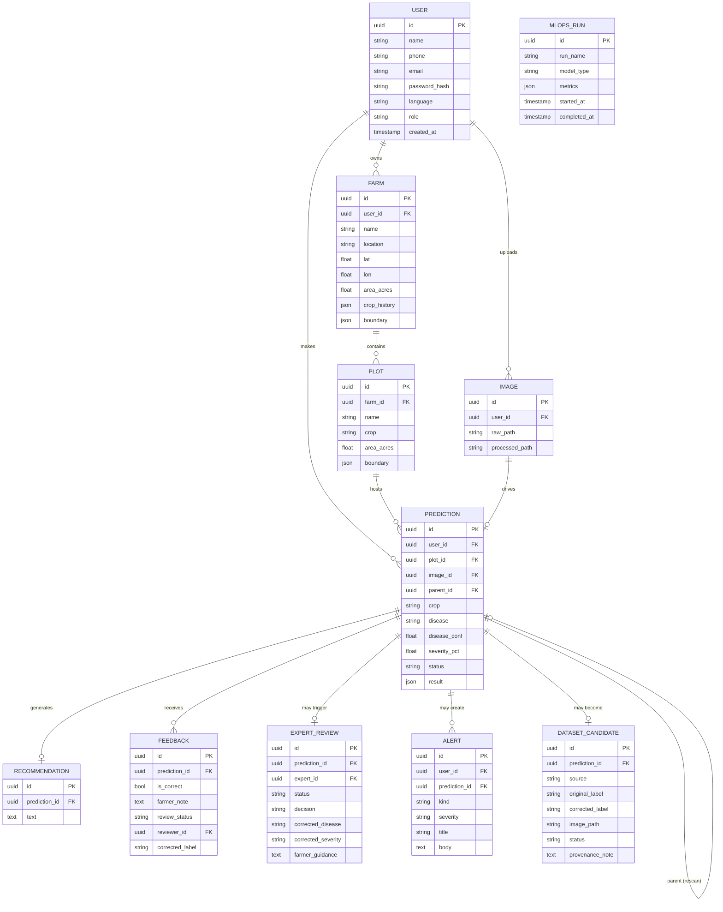
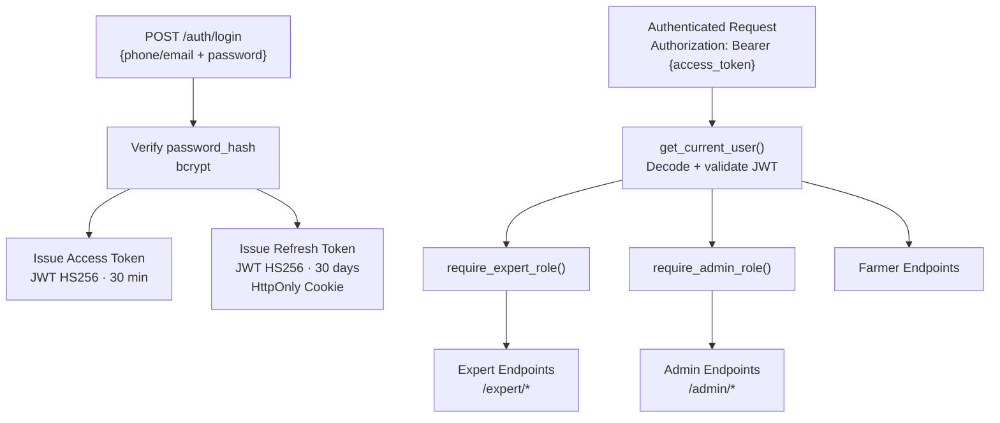
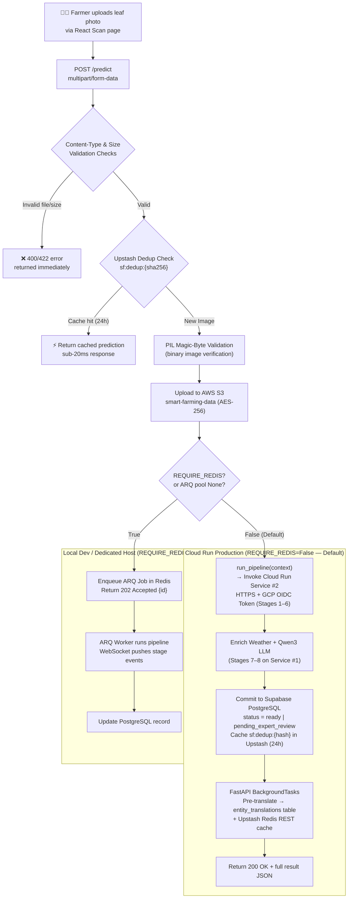
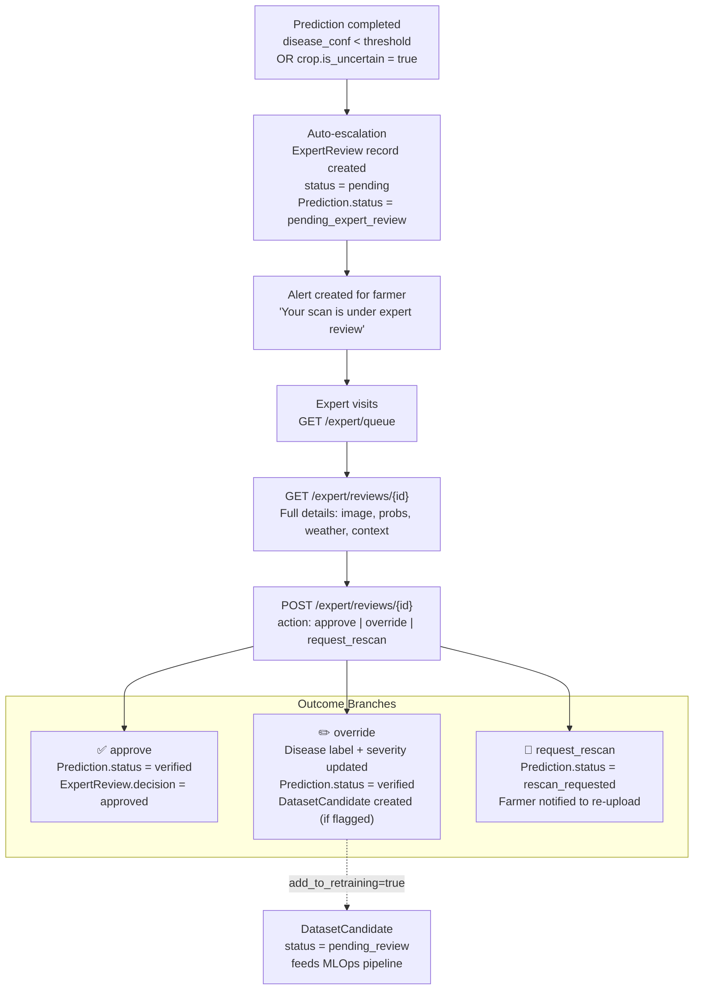
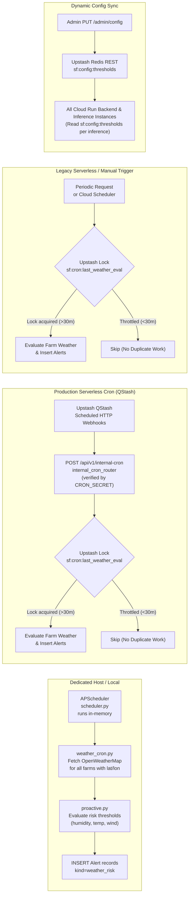
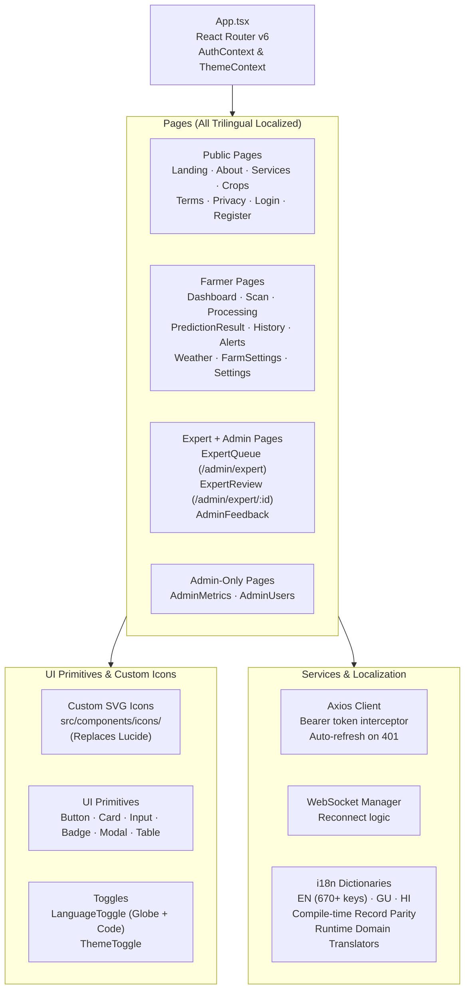

# Architecture & System Design Document

**Project:** AI-Powered Smart Farming  
**Version:** 2.0  
**Date:** 06 October 2026  
**Status:** Active / Production Reference  

---

## Table of Contents

1. [System Overview](#1-system-overview)
2. [High-Level Architecture](#2-high-level-architecture)
3. [Layer Breakdown](#3-layer-breakdown)
   - 3.1 [Client Layer](#31-client-layer)
   - 3.2 [API Gateway](#32-api-gateway)
   - 3.3 [Async Job Queue](#33-async-job-queue)
   - 3.4 [ML Pipeline](#34-ml-pipeline)
   - 3.5 [Persistence Layer](#35-persistence-layer)
4. [Service Boundaries](#4-service-boundaries)
   - 4.1 [FastAPI Application](#41-fastapi-application)
   - 4.2 [Pipeline Orchestrator](#42-pipeline-orchestrator)
   - 4.3 [Shared Pipeline Context](#43-shared-pipeline-context)
   - 4.4 [Storage Abstraction Layer](#44-storage-abstraction-layer)
5. [Data Models](#5-data-models)
6. [Authentication & Authorization](#6-authentication--authorization)
7. [Data Flow: Scan & Predict](#7-data-flow-scan--predict)
8. [Expert Review Flow](#8-expert-review-flow)
9. [Scheduler & Background Jobs](#9-scheduler--background-jobs)
10. [Frontend Architecture](#10-frontend-architecture)
11. [Infrastructure & Deployment](#11-infrastructure--deployment)
12. [Non-Functional Characteristics](#12-non-functional-characteristics)

---

## 1. System Overview

**AI-Powered Smart Farming** is a full-stack, production-grade crop disease diagnostic platform built for Indian farmers. A farmer photographs a diseased leaf using their mobile device; within seconds the platform identifies the crop, classifies the disease, estimates severity, detects pests, factors in live weather conditions, and delivers actionable treatment recommendations in the farmer's preferred language (English, Hindi, or Gujarati).

The system is architected around four core tenets:

| Tenet | Implementation |
|---|---|
| **Accuracy** | Multi-model ensemble (EfficientNet-B0 → B2 → YOLOv8) with uncertainty escalation to human experts |
| **Serverless Scalability** | Decoupled microservices on Google Cloud Run scaling to zero (512MiB API Gateway + 2GiB Inference Service) |
| **Traceability** | Every prediction carries a `provenance` block capturing exact model versions, config hash, and pipeline timing |
| **Extensibility** | Config-driven model routing, hot-reload support, storage-agnostic interface (AWS S3/local), and built-in MLOps |

---

## 2. High-Level Architecture


```mermaid
flowchart TD
    subgraph CLIENT["Client Layer (Vercel)"]
        SPA["React 18 + TypeScript SPA (Vercel)\nVite 6 · Tailwind CSS · Anti-Vibecoded\nCustom SVG Icons · Sharp Radii\ni18n: EN / HI / GU (670+ keys)\nRoles: Farmer · Expert · Admin"]
    end

    subgraph GCP["Google Cloud Platform (us-central1)"]
        subgraph GATEWAY["Cloud Run Service #1: Main Backend"]
            API["FastAPI · uvicorn (512MiB / 1 vCPU)\nPublic Ingress · CORS · Rate Limiting (slowapi)\nJWT Auth · AWS S3 client\nREQUIRE_REDIS=False → Sync (Production Default)\nREQUIRE_REDIS=True  → ARQ Queue Mode"]
        end

        subgraph INFERENCE["Cloud Run Service #2: Model Inference"]
            INF["FastAPI + PyTorch CPU (2GiB / 2 vCPU)\nPrivate Ingress (GCP OIDC Auth)\n7x Preloaded Models (Crop, Disease, Pest)"]
        end
    end

    subgraph AWS["AWS Cloud"]
        subgraph OBJ["Object Storage"]
            S3["AWS S3 Object Storage\nBucket: smart-farming-data\nPresigned URLs (AES-256)"]
        end
    end

    subgraph PERSIST["Persistence & State Layer"]
        DB["Supabase PostgreSQL\nManaged DB (Session Pooler / SSL)"]
        UPSTASH["Upstash Serverless Redis REST\nHTTPS Token Auth\n• Translation Cache (en/hi/gu)\n• Image Dedup Cache (SHA-256)\n• Dynamic ML Threshold Sync\n• Lazy Weather Cron Locks"]
    end

    subgraph EXTERNAL["External AI & Scheduling Services"]
        HF["HuggingFace Inference API / Gemini\n(Agronomist LLM)"]
        OWM["OpenWeather API"]
        QSTASH["Upstash QStash\nServerless Cron & Webhook Delivery\nHTTPS webhooks → /api/v1/internal-cron\nVerified via CRON_SECRET"]
    end

    SPA -- "HTTPS REST" --> API
    API -- "OIDC IdToken HTTPS" --> INF
    API -- "AWS S3 API (SigV4)" --> S3
    API -- "asyncpg / psycopg2 SSL" --> DB
    API -- "HTTPS REST (Bearer)" --> UPSTASH
    API -- "REST" --> HF
    API -- "REST" --> OWM
    QSTASH -- "HTTP Webhook (CRON_SECRET)" --> API
```

---

## 3. Layer Breakdown

### 3.1 Client Layer

| Property | Detail |
|---|---|
| **Framework** | React 18 + TypeScript 5.6, bundled with Vite 6 |
| **Styling** | Tailwind CSS utility classes with anti-vibecoded design system (sharp radii `rounded-sm`, border elevation, farmer-green and warm-neutral theme) |
| **Iconography** | Custom SVG icon library in `src/components/icons/` (zero third-party icon dependencies) |
| **Routing** | React Router v6 (client-side SPA with role-based protected route guards) |
| **State** | `AuthContext` (JWT + profile + i18n language), `ThemeContext`, and local component state |
| **HTTP Client** | Axios with Bearer token injection and automatic 401 refresh interceptors |
| **Real-time** | Native WebSocket API for live pipeline progress tracking |
| **i18n & Localization** | Trilingual (EN, HI, GU) with 670+ translation keys and 100% compile-time TypeScript key parity (`gu.ts` and `hi.ts` typed against `en.ts`), runtime domain translators (`domain.ts`), and `LanguageToggle` component |
| **Roles** | `farmer`, `expert`, `admin` |

> **Note:** A native Flutter mobile client (`mobile/`) serves the farmer-facing use case independently from the React web dashboard. It authenticates via the same JWT API, uses `RemoteConfigService` to dynamically discover the backend URL from Supabase `app_config`, and includes a center-crosshair GIS boundary drawing screen with magnetic farm-boundary snapping.

### 3.2 API Gateway

The FastAPI application is the single ingress for all client traffic.

| Concern | Mechanism |
|---|---|
| **Concurrency** | `uvicorn` ASGI server; async request handlers |
| **CORS** | Configurable allowed origins via middleware |
| **Rate Limiting** | `slowapi` (token-bucket per IP/user) |
| **Auth** | JWT HS256 Bearer tokens; `HttpOnly` refresh cookie |
| **Static Files** | `/data` → `backend/data/` (processed images, exports) |
| **Lifespan** | DB init, ARQ pool init, APScheduler start, weather cron bootstrap |

### 3.3 Execution Model & Job Queue

The platform supports two deployment execution modes depending on infrastructure constraints:

#### Mode A: Serverless Synchronous Microservices (Cloud Run Production — Default)
In Cloud Run, persistent background polling workers (like ARQ) would consume the entire monthly Always Free quota in ~2 days. To allow both services to scale to **0 instances** when idle, `REQUIRE_REDIS=False` is the **production default**. When `REQUIRE_REDIS=False` **or** the ARQ pool is `None`, the pipeline executes fully synchronously via `run_pipeline()`:

1. `POST /predict` receives the leaf upload.
2. The image is saved locally/temporarily and its SHA-256 hash is computed.
3. **Upstash Dedup Check** — `sf:dedup:{hash}` is consulted. If a cache hit exists (24h TTL), the cached result is returned immediately in under 20ms.
4. **PIL magic-byte validation** — the image bytes are inspected at the binary level to confirm the file is a genuine image, guarding against content-type spoofing.
5. The image is uploaded to **AWS S3** (`smart-farming-data`) with AES-256 encryption.
6. **`run_pipeline(context)`** is called synchronously, which invokes **Cloud Run Service #2 (`inference-service`)** over HTTPS using GCP OIDC Identity Tokens and runs all ML stages (Stages 1–6).
7. Weather enrichment (Stage 7) and LLM advisory recommendations (Stage 8 — Qwen3) are generated by Service #1.
8. **FastAPI `BackgroundTasks`** pre-translates the advisory into Hindi (`hi`) and Gujarati (`gu`), persisting translations to the **`entity_translations`** table in Supabase PostgreSQL for instant future lookup without re-translating.
9. The full prediction result, provenance block, and S3 presigned URLs are committed to Supabase PostgreSQL and cached in Upstash Redis REST (`sf:dedup:{hash}`, 24h TTL). The `200 OK` response with the full result JSON is returned.

> [!NOTE]
> When no `lat`/`lon` is provided by the client, `predict.py` currently falls back to the hardcoded default **52.2297 N, 21.0122 E (Warsaw, Poland)** for weather lookups. This is a known dev artifact that should be replaced with a proper farm-location fallback before production use with location-sensitive recommendations.

#### Mode B: Asynchronous Queue (Dedicated Host / Local Development)
When Redis is provisioned and `REQUIRE_REDIS=True`:


```mermaid
sequenceDiagram
    participant C as React Client
    participant A as FastAPI
    participant R as Redis / ARQ
    participant W as ARQ Worker
    participant DB as PostgreSQL

    C->>A: POST /predict (multipart)
    A->>A: Validate file + quality check
    A->>DB: INSERT Prediction(status=processing)
    A->>R: enqueue(process_prediction_job, prediction_id)
    A-->>C: 202 Accepted {prediction_id}

    C->>A: WS /ws/predictions/{id}
    A->>R: SUBSCRIBE prediction_status:{id}

    W->>W: run_pipeline(context)
    loop Each stage
        W->>R: PUBLISH stage_event
        R-->>A: event forwarded
        A-->>C: WS push {stage, status, partial_result}
    end

    W->>DB: UPDATE Prediction(status=ready, result=JSON)
    C->>A: GET /predictions/{id}
    A-->>C: Full result JSON
```

- **Prediction lifecycle:** `processing` → `ready` | `failed` | `pending_expert_review` → `verified` | `rescan_requested`

### 3.4 ML Pipeline

The pipeline is a linear, context-passing chain of 8 specialised stages. In production, Stages 1 through 6 run inside **Service #2 (`inference-service`)**, while Weather (Stage 7) and LLM Recommendation (Stage 8) are coordinated by **Service #1 (`smart-farming-backend`)**.


```mermaid
flowchart LR
    IMG["📷 Raw Image"] --> S1

    subgraph INF["Service #2 (Cloud Run Inference)"]
        S1["Stage 1\nPreprocessing\nOpenCV"]
        S2["Stage 2\nCrop ID\nEfficientNet-B0"]
        S3["Stage 3\nDecision Routing\nconfig.yaml"]
        S4["Stage 4\nDisease Class\nEfficientNet-B2"]
        S5["Stage 5\nSeverity\nHSV Contour"]
        S6["Stage 6\nPest Detection\nYOLOv8-cls"]
    end

    subgraph BK["Service #1 (Cloud Run Backend)"]
        S7["Stage 7\nWeather\nOpenWeatherMap"]
        S8["Stage 8\nRecommendation\nQwen3 LLM"]
    end

    S1 --> S2 --> S3 --> S4 --> S5 --> S6
    S6 -->|JSON Context| S7 --> S8
    S8 --> RES["📋 Prediction Result\n+ Provenance Block"]
```

| Stage | Model / Tool | Output Written to Context |
|---|---|---|
| **1 · Preprocessing** | OpenCV (blur, brightness, leaf mask) | `image.processed_path`, `quality_score`, `blur_score`, `leaf_detected` |
| **2 · Crop Identification** | EfficientNet-B0 | `crop.label`, `crop.confidence`, `crop.uncertainty`, `crop.is_uncertain` |
| **3 · Decision Routing** | `config.yaml` lookup | Selects per-crop disease model; sets `crop.status` |
| **4 · Disease Classification** | EfficientNet-B2 (per-crop) | `disease.label`, `disease.confidence`, `disease.all_probs`, `disease.escalation_required` |
| **5 · Severity Estimation** | HSV contour heuristic | `severity.percent`, `severity.bucket` (Healthy / Mild / Moderate / Severe) |
| **6 · Pest Detection** | YOLOv8-cls | `pests[{label, confidence}]`, `pest_classification` |
| **7 · Weather Enrichment** | OpenWeatherMap REST API | `weather.{temperature, humidity, wind_speed, condition}` |
| **8 · Recommendation** | Qwen3 (HuggingFace / nscale) | `recommendation.{immediate_action, treatment, prevention, monitoring}` |

> [!NOTE]
> Stage 3 (Decision Routing) allows per-crop model overrides. If a specialised EfficientNet-B2 model is registered for the detected crop in `config.yaml`, it is used; otherwise a generalist model handles classification. This makes adding new crop models purely a configuration change — no code deploy required.

### 3.5 Persistence Layer

| Store | Purpose | Implementation |
|---|---|---|
| **Relational DB** | All structured data (users, farms, predictions, feedback) | Supabase PostgreSQL (`sslmode=require`) · SQLite (dev/test) |
| **Object Store** | Raw uploads, processed images, audio files | Google Cloud Storage (`smart-farming-data` via S3 HMAC API) · AWS S3 · Local |
| **Serverless Cache & State** | Sub-20ms translation caching, prediction dedup, dynamic thresholds, weather caching & lazy cron locks | Upstash Serverless Redis REST (`UPSTASH_REDIS_REST_URL` via HTTPS token auth) |
| **Entity Translations Table** | Per-field multilingual translations for instant lookup without re-translating | `entity_translations` table in Supabase PostgreSQL — columns: `entity_type`, `entity_id`, `field_name`, `language`, `translated_text`, `status`; populated asynchronously by FastAPI `BackgroundTasks` after each prediction |
| **App Config / Remote Config** | Mobile dynamic backend URL discovery | Supabase PostgreSQL `public.app_config` table — key-value store queried via PostgREST REST API; read-only for client apps via `anon` RLS policy |

The storage interface (`storage.py`) is fully abstracted — switching between `local` or `s3` backends is a single environment variable change (`STORAGE_BACKEND`).

---

## 4. Service Boundaries

### 4.1 FastAPI Application

**Entry point:** `backend/src/app/main.py`

Responsibilities:
- Wires all API routers: `/auth`, `/predict`, `/predictions`, `/farms`, `/expert`, `/admin`, `/ws`, `/config`, `/tts`, `/mlops`, `/translation`, `/alerts`, `/crops`, `/history`, `/feedback`, `/profile`, `/health`, `/internal-cron` (also mounted at `/api/v1/internal-cron` for QStash webhook delivery)
- Registers lifespan hooks: `initialize_database()` → `init_arq()` → `sync_existing_audio_to_storage()` (TTS audio sync)
- Applies middleware stack: CORS → rate limiter → request ID injection
- Mounts `backend/data/` at `/data` for static file serving (processed images, exports); the `/data/{file_path}` endpoint serves local files **or** redirects to S3 presigned URLs depending on `STORAGE_BACKEND`

### 4.2 Pipeline Orchestrator

**File:** `backend/src/app/pipeline.py`

```python
# Public interface
run_pipeline(context: dict) -> dict
reload_config()                          # Hot-reloads config.yaml + preprocessor
```

Internally, every stage is wrapped by `_exec_stage(name, fn, context)` which:
1. Records `started_at` timestamp
2. Calls the stage function
3. Records `completed_at` and `duration_ms`
4. Sets `context["status"][stage_name]` to `"completed"` or `"failed"`
5. Appends non-fatal warnings to `context["notes"]`

After all stages complete, `build_provenance(context)` constructs a metadata block that is attached to the prediction result for full traceability.

### 4.3 Shared Pipeline Context

Every pipeline run is driven by a single mutable `context` dict that flows through all 8 stages. Its schema is defined in `backend/src/app/context.py`:

```python
{
  # Identity
  "request_id": str,           # UUID for this pipeline run

  # Input
  "user": {
    "user_id": str,
    "location": str,
    "lat": float, "lon": float,
    "language": str             # "en" | "hi" | "gu"
  },

  # Image processing outputs
  "image": {
    "raw_path": str,
    "processed_path": str,
    "leaf_crop": np.ndarray,   # Cropped leaf region
    "quality_score": float,
    "blur_score": float,
    "brightness_score": float,
    "leaf_detected": bool
  },

  # Crop identification outputs
  "crop": {
    "label": str, "confidence": float,
    "model_name": str, "model_version": str,
    "confidence_rating": str,  # "High" | "Medium" | "Low"
    "uncertainty": float, "is_uncertain": bool,
    "status": str
  },

  # Disease classification outputs
  "disease": {
    "label": str, "confidence": float,
    "all_probs": dict,
    "model_used": str, "model_name": str,
    "confidence_rating": str,
    "uncertainty": float, "is_uncertain": bool,
    "escalation_required": bool
  },

  # Severity estimation outputs
  "severity": {
    "percent": float,
    "affected_area": float,
    "bucket": str,             # "Mild" | "Moderate" | "Severe"
    "quality_flag": str
  },

  # Pest detection outputs
  "pests": [{"label": str, "confidence": float}],
  "pest_classification": {
    "model_type": str, "model_used": str,
    "top_k": int, "all_probs": dict,
    "available": bool, "status": str
  },

  # Weather enrichment outputs
  "weather": {
    "temperature_celsius": float,
    "humidity_percent": float,
    "pressure_hpa": float,
    "wind_speed_m_s": float,
    "condition": str, "description": str
  },

  # LLM recommendation outputs
  "recommendation": {
    "immediate_action": str,
    "treatment": str,
    "prevention": str,
    "monitoring": str,
    "provider": str, "model": str,
    "is_fallback": bool
  },

  # Pipeline metadata
  "notes": [str],              # Non-fatal warnings from any stage
  "stages": {
    "<stage_name>": {
      "status": str,
      "started_at": str,
      "completed_at": str,
      "duration_ms": int
    }
  },
  "status": { ... },           # Per-stage status shorthand
  "provenance": {
    "schema_version": str,
    "config": dict,
    "models": dict,
    "weather_provider": str,
    "recommendation_provider": str,
    "pipeline_duration_ms": int,
    "generated_at": str        # ISO 8601
  }
}
```

### 4.4 Storage Abstraction Layer

**File:** `backend/src/app/core/storage.py`


```mermaid
classDiagram
    class StorageBackend {
        <<interface>>
        +save(file, path) str
        +get_url(path, expiry) str
        +delete(path)
        +list_objects(prefix) list
    }
    class LocalStorage {
        +root: Path
        +save()
        +get_url()
        +delete()
        +list_objects()
    }
    class S3Storage {
        +bucket: str
        +client: boto3.Client
        +save()
        +get_url()  // presigned, 15-min expiry
        +delete()
        +list_objects()
    }
    StorageBackend <|-- LocalStorage
    StorageBackend <|-- S3Storage
```

| Backend | `STORAGE_BACKEND` value | URL type |
|---|---|---|
| Local filesystem | `local` | Relative path under `/data` static mount |
| AWS S3 / MinIO | `s3` | Presigned URL (15-minute expiry) |

---

## 5. Data Models


```mermaid
erDiagram
    USER {
        uuid id PK
        string name
        string phone
        string email
        string password_hash
        string language
        string role
        timestamp created_at
    }
    FARM {
        uuid id PK
        uuid user_id FK
        string name
        string location
        float lat
        float lon
        float area_acres
        json crop_history
        json boundary
    }
    PLOT {
        uuid id PK
        uuid farm_id FK
        string name
        string crop
        float area_acres
        json boundary
    }
    IMAGE {
        uuid id PK
        uuid user_id FK
        string raw_path
        string processed_path
    }
    PREDICTION {
        uuid id PK
        uuid user_id FK
        uuid plot_id FK
        uuid image_id FK
        uuid parent_id FK
        string crop
        string disease
        float disease_conf
        float severity_pct
        string status
        json result
    }
    RECOMMENDATION {
        uuid id PK
        uuid prediction_id FK
        text text
    }
    FEEDBACK {
        uuid id PK
        uuid prediction_id FK
        bool is_correct
        text farmer_note
        string review_status
        uuid reviewer_id FK
        string corrected_label
    }
    EXPERT_REVIEW {
        uuid id PK
        uuid prediction_id FK
        uuid expert_id FK
        string status
        string decision
        string corrected_disease
        string corrected_severity
        text farmer_guidance
    }
    ALERT {
        uuid id PK
        uuid user_id FK
        uuid prediction_id FK
        string kind
        string severity
        string title
        text body
    }
    DATASET_CANDIDATE {
        uuid id PK
        uuid prediction_id FK
        string source
        string original_label
        string corrected_label
        string image_path
        string status
        text provenance_note
    }
    MLOPS_RUN {
        uuid id PK
        string run_name
        string model_type
        json metrics
        timestamp started_at
        timestamp completed_at
    }

    USER ||--o{ FARM : "owns"
    FARM ||--o{ PLOT : "contains"
    USER ||--o{ IMAGE : "uploads"
    USER ||--o{ PREDICTION : "makes"
    PLOT ||--o{ PREDICTION : "hosts"
    IMAGE ||--o| PREDICTION : "drives"
    PREDICTION ||--o| PREDICTION : "parent (rescan)"
    PREDICTION ||--o| RECOMMENDATION : "generates"
    PREDICTION ||--o{ FEEDBACK : "receives"
    PREDICTION ||--o| EXPERT_REVIEW : "may trigger"
    PREDICTION ||--o{ ALERT : "may create"
    PREDICTION ||--o| DATASET_CANDIDATE : "may become"
```

---

## 6. Authentication & Authorization


```mermaid
flowchart TD
    LOGIN["POST /auth/login\n{phone/email + password}"]
    VERIFY["Verify password_hash\nbcrypt"]
    AT["Issue Access Token\nJWT HS256 · 30 min"]
    RT["Issue Refresh Token\nJWT HS256 · 30 days\nHttpOnly Cookie"]
    REQ["Authenticated Request\nAuthorization: Bearer {access_token}"]
    GUARD["get_current_user()\nDecode + validate JWT"]
    ROLE_E["require_expert_role()"]
    ROLE_A["require_admin_role()"]
    FARMER_EP["Farmer Endpoints"]
    EXPERT_EP["Expert Endpoints\n/expert/*"]
    ADMIN_EP["Admin Endpoints\n/admin/*"]

    LOGIN --> VERIFY --> AT & RT
    REQ --> GUARD
    GUARD --> FARMER_EP
    GUARD --> ROLE_E --> EXPERT_EP
    GUARD --> ROLE_A --> ADMIN_EP
```

| Token | Algorithm | Lifetime | Transport |
|---|---|---|---|
| Access Token | HS256 JWT | 30 minutes | `Authorization: Bearer` header |
| Refresh Token | HS256 JWT | 30 days | `HttpOnly` cookie (SameSite=Strict) |

**Role hierarchy:**

```
admin  ⊃  expert  ⊃  farmer
```

Each role inherits permissions from the roles below it. Role checks are applied via FastAPI `Depends()` injection at the router level.

---

## 7. Data Flow: Scan & Predict


```mermaid
flowchart TD
    A["👨‍🌾 Farmer uploads leaf photo\nvia React Scan page"]
    B["POST /predict\nmultipart/form-data"]
    C{"Content-Type & Size\nValidation Checks"}
    C1["❌ 400/422 error\nreturned immediately"]
    D{"Upstash Dedup Check\nsf:dedup:{sha256}"}
    D1["⚡ Return cached prediction\nsub-20ms response"]
    PIL["PIL Magic-Byte Validation\n(binary image verification)"]
    E["Upload to AWS S3\nsmart-farming-data (AES-256)"]
    G{"REQUIRE_REDIS?\nor ARQ pool None?"}

    subgraph SYNC["Cloud Run Production (REQUIRE_REDIS=False — Default)"]
        H1["run_pipeline(context)\n→ Invoke Cloud Run Service #2\nHTTPS + GCP OIDC Token (Stages 1–6)"]
        H2["Enrich Weather + Qwen3 LLM\n(Stages 7–8 on Service #1)"]
        H3["Commit to Supabase PostgreSQL\nstatus = ready | pending_expert_review\nCache sf:dedup:{hash} in Upstash (24h)"]
        H4["FastAPI BackgroundTasks\nPre-translate → entity_translations table\n+ Upstash Redis REST cache"]
        H5["Return 200 OK + full result JSON"]
    end

    subgraph ASYNC["Local Dev / Dedicated Host (REQUIRE_REDIS=True)"]
        J1["Enqueue ARQ Job in Redis\nReturn 202 Accepted {id}"]
        J2["ARQ Worker runs pipeline\nWebSocket pushes stage events"]
        J3["Update PostgreSQL record"]
    end

    A --> B --> C
    C -- "Invalid file/size" --> C1
    C -- "Valid" --> D
    D -- "Cache hit (24h)" --> D1
    D -- "New Image" --> PIL --> E --> G
    G -- "False (Default)" --> H1 --> H2 --> H3 --> H4 --> H5
    G -- "True" --> J1 --> J2 --> J3
```

**Validation checks at `POST /predict`** (in execution order):

1. MIME type whitelist (`image/jpeg`, `image/png`, `image/webp`) + file size limit (configurable, default 10 MB)
2. SHA-256 dedup check via Upstash Redis REST — returns cached result immediately if hit (24h TTL)
3. **PIL magic-byte verification** — inspects raw bytes to confirm genuine image (prevents content-type spoofing)
4. Upload to AWS S3 (AES-256)
5. Synchronous OpenCV blur + brightness pre-check inside pipeline Stage 1 (rejects unusable images)

---

## 8. Expert Review Flow

Low-confidence predictions are automatically escalated to the expert queue rather than being silently served to farmers.


```mermaid
flowchart TD
    PRED["Prediction completed\ndisease_conf < threshold\nOR crop.is_uncertain = true"]
    ESC["Auto-escalation\nExpertReview record created\nstatus = pending\nPrediction.status = pending_expert_review"]
    ALERT_F["Alert created for farmer\n'Your scan is under expert review'"]
    Q["Expert visits\nGET /expert/queue"]
    DET["GET /expert/reviews/{id}\nFull details: image, probs, weather, context"]
    ACT["POST /expert/reviews/{id}\naction: approve | override | request_rescan"]

    subgraph OUTCOMES["Outcome Branches"]
        OUT_A["✅ approve\nPrediction.status = verified\nExpertReview.decision = approved"]
        OUT_O["✏️ override\nDisease label + severity updated\nPrediction.status = verified\nDatasetCandidate created (if flagged)"]
        OUT_R["🔄 request_rescan\nPrediction.status = rescan_requested\nFarmer notified to re-upload"]
    end

    PRED --> ESC --> ALERT_F --> Q --> DET --> ACT
    ACT --> OUT_A & OUT_O & OUT_R
    OUT_O -. "add_to_retraining=true" .-> DC["DatasetCandidate\nstatus = pending_review\nfeeds MLOps pipeline"]
```

> [!IMPORTANT]
> Expert overrides that are flagged for retraining feed the `DatasetCandidate` table, which serves as the ground-truth curation mechanism for future model fine-tuning cycles tracked in `MLOpsRun`.

---

## 9. Scheduler & Background Jobs


```mermaid
flowchart LR
    subgraph DEDICATED["Dedicated Host / Local"]
        SCHED["APScheduler\nscheduler.py\nruns in-memory"]
        WC["weather_cron.py\nFetch OpenWeatherMap\nfor all farms with lat/lon"]
        PA["proactive.py\nEvaluate risk thresholds\n(humidity, temp, wind)"]
        ALC["INSERT Alert records\nkind=weather_risk"]
        SCHED --> WC --> PA --> ALC
    end

    subgraph QSTASH_BLOCK["Production Serverless Cron (QStash)"]
        QS["Upstash QStash\nScheduled HTTP Webhooks"]
        IC["POST /api/v1/internal-cron\ninternal_cron_router\n(verified by CRON_SECRET)"]
        QS_LOCK{"Upstash Lock\nsf:cron:last_weather_eval"}
        QS_EVAL["Evaluate Farm Weather\n& Insert Alerts"]
        QS --> IC --> QS_LOCK
        QS_LOCK -- "Lock acquired (>30m)" --> QS_EVAL
        QS_LOCK -- "Throttled (<30m)" --> QS_SKIP["Skip (No Duplicate Work)"]
    end

    subgraph SERVERLESS["Legacy Serverless / Manual Trigger"]
        REQ["Periodic Request\nor Cloud Scheduler"]
        LOCK{"Upstash Lock\nsf:cron:last_weather_eval"}
        EVAL["Evaluate Farm Weather\n& Insert Alerts"]
        REQ --> LOCK
        LOCK -- "Lock acquired (>30m)" --> EVAL
        LOCK -- "Throttled (<30m)" --> SKIP["Skip (No Duplicate Work)"]
    end

    subgraph CONFIG_SYNC["Dynamic Config Sync"]
        ADMIN["Admin PUT /admin/config"]
        UP_CONF["Upstash Redis REST\nsf:config:thresholds"]
        INSTANCES["All Cloud Run Backend & Inference Instances\n(Read sf:config:thresholds per inference)"]
        ADMIN --> UP_CONF --> INSTANCES
    end
```

| Job / Mechanism | Trigger | Implementation / Purpose |
|---|---|---|
| `qstash_cron` | Scheduled QStash HTTP webhook (production) | Upstash QStash sends HTTP POST to `/api/v1/internal-cron`; `CRON_SECRET` header is verified by `internal_cron_router` before executing cron logic |
| `weather_cron` | Every 30 min (APScheduler / QStash / manual request) | Proactively fetches weather for all registered farms, cached in Upstash Redis REST (`sf:weather:{lat}:{lon}`) for 30 minutes |
| `proactive_alerts` | After each `weather_cron` | Evaluates agronomic thresholds and inserts `Alert` records into Supabase PostgreSQL |
| `serverless_cron_lock` | Upstash Redis REST | Atomically manages `sf:cron:last_weather_eval` timestamp to prevent duplicate alert evaluations across autoscaled instances |
| `dynamic_threshold_sync` | Admin `PUT /admin/config` | Updates `sf:config:thresholds` in Upstash Redis REST, allowing all Cloud Run instances to instantly pick up threshold changes without worker restarts |

---

## 10. Frontend Architecture

### Route Inventory

**Public routes** (no auth required):

| Route | Page Component | Description |
|---|---|---|
| `/` | `LandingPage` | Product overview with interactive live diagnostic pipeline demo |
| `/about` | `AboutPage` | Project background and agricultural context |
| `/services` | `ServicesPage` | Feature showcase and capabilities |
| `/crops` | `CropsPage` | Supported crop catalogue, pathogens, and symptoms |
| `/terms` | `TermsPage` | Terms of Service agreement |
| `/privacy` | `PrivacyPage` | Privacy and telemetry policy |
| `/auth/login` | `LoginPage` | Authentication interface |
| `/auth/register` | `RegisterPage` | Multi-step user registration |
| `/auth/forgot-password` | `ForgotPasswordPage` | Password reset request |
| `/auth/reset-password` | `ResetPasswordPage` | Password reset confirmation with token |
| `/docs` | — | External redirect to Swagger documentation |

**Authenticated routes** (Farmer+):

| Route | Page Component | Description |
|---|---|---|
| `/dashboard` | `DashboardPage` | Overview: recent scans, alerts, weather |
| `/scan` | `ScanPage` | Upload leaf photo, start prediction |
| `/predictions/:id/processing` | `ProcessingPage` | Live WebSocket progress view with skeleton states |
| `/predictions/:id` | `PredictionResultPage` | Full diagnosis: disease, severity, pests, Grad-CAM, audio |
| `/history` | `HistoryPage` | Diagnostic Archive: past predictions with search/filter |
| `/farm/settings` | `FarmSettingsPage` | Farm and plot management with boundary maps |
| `/settings` | `SettingsPage` | User preferences, theme, and language settings |
| `/weather` | `WeatherPage` | Meteorological intelligence dashboard with TTS advisory |
| `/alerts` | `AlertsPage` | Notification center (auto-marks read on navigation) |

**Admin + Expert routes** (`adminOnly` guard — accessible to both admin and expert roles):

| Route | Page Component | Description |
|---|---|---|
| `/admin/feedback` | `AdminFeedbackPage` | Agronomist review desk for farmer feedback |
| `/admin/expert` | `ExpertQueuePage` | Triage desk for low-confidence scans (<70%) |
| `/admin/expert/:id` | `ExpertReviewPage` | Side-by-side verification and diagnosis override |

**Admin-only routes** (`strictAdminOnly` guard):

| Route | Page Component | Description |
|---|---|---|
| `/admin/metrics` | `AdminMetricsPage` | System-wide ML telemetry, drift signals, and usage metrics |
| `/admin/users` | `AdminUsersPage` | User directory and role assignment |

> [!NOTE]
> Expert queue/review routes live under `/admin/expert` and `/admin/expert/:id`. Both expert and admin roles can access these routes via the `adminOnly` guard.

### Component Architecture


```mermaid
flowchart TD
    APP["App.tsx\nReact Router v6\nAuthContext & ThemeContext"]

    subgraph PAGES["Pages (All Trilingual Localized)"]
        PUB["Public Pages\nLanding · About · Services · Crops\nTerms · Privacy · Login · Register"]
        FARMER["Farmer Pages\nDashboard · Scan · Processing\nPredictionResult · History · Alerts\nWeather · FarmSettings · Settings"]
        EXPERT_ADMIN["Expert + Admin Pages\nExpertQueue (/admin/expert)\nExpertReview (/admin/expert/:id)\nAdminFeedback"]
        ADMIN["Admin-Only Pages\nAdminMetrics · AdminUsers"]
    end

    subgraph UI["UI Primitives & Custom Icons"]
        ICONS["Custom SVG Icons\nsrc/components/icons/\n(Replaces Lucide)"]
        UI_PRIM["UI Primitives\nButton · Card · Input · Badge · Modal · Table"]
        TOGGLES["Toggles\nLanguageToggle (Globe + Code)\nThemeToggle"]
    end

    subgraph SERVICES["Services & Localization"]
        AXIOS["Axios Client\nBearer token interceptor\nAuto-refresh on 401"]
        WS["WebSocket Manager\nReconnect logic"]
        I18N["i18n Dictionaries\nEN (670+ keys) · GU · HI\nCompile-time Record Parity\nRuntime Domain Translators"]
    end

    APP --> PAGES
    PAGES --> UI
    PAGES --> SERVICES
```

### i18n Strategy

All user-visible strings are loaded from typed translation dictionaries (`src/i18n/en.ts`, `gu.ts`, `hi.ts`). Compile-time parity is strictly enforced in TypeScript (`Record<keyof typeof en, string>`). The active language is managed via `AuthContext`, persisted in `localStorage` and the database user profile, and toggleable instantaneously via `LanguageToggle` without requiring page reloads. Dynamic entity and meteorological terms are resolved at runtime via `src/i18n/domain.ts`.

---

## 11. Infrastructure & Deployment

```mermaid
flowchart LR
    subgraph DEV["Local Development"]
        UVICORN["uvicorn backend :8000"]
        VITE["vite dev server :5173"]
        SQLITE["SQLite (dev_database.db)"]
        LOCAL_S["Local filesystem\nbackend/data/"]
    end

    subgraph PROD["Production Environment"]
        VERCEL["Vercel Edge Network\nReact SPA (smart-farming-dashboard)"]
        CR_BACKEND["Cloud Run Service #1\nsmart-farming-backend\n(FastAPI · 512MiB · Public)"]
        CR_INFER["Cloud Run Service #2\ninference-service\n(PyTorch CPU · 2GiB · Private)"]
        S3_STORE["AWS S3 Object Storage\nBucket: smart-farming-data"]
        SUPABASE_PG["Supabase PostgreSQL\nManaged DB (Session Pooler / SSL)"]
        UPSTASH_REDIS["Upstash Serverless Redis REST\n(Token Auth · HTTPS)"]
    end

    VERCEL -->|HTTPS REST| CR_BACKEND
    CR_BACKEND -->|GCP OIDC Auth| CR_INFER
    CR_BACKEND -->|AWS S3 API (SigV4)| S3_STORE
    CR_BACKEND -->|SSL| SUPABASE_PG
    CR_BACKEND -->|HTTPS REST| UPSTASH_REDIS
```

### Environment Configuration (Production Cloud Run)

| Variable | Value / Purpose |
|---|---|
| `DATABASE_URL` | Supabase PostgreSQL DSN (`postgresql://postgres.<PROJECT_REF>:<DB_PASSWORD>@aws-0-<REGION>.pooler.supabase.com:5432/postgres?sslmode=require`) |
| `STORAGE_BACKEND` | `s3` (AWS S3) |
| `AWS_ACCESS_KEY_ID` | AWS IAM Access Key ID (`<YOUR_AWS_ACCESS_KEY_ID>`) |
| `AWS_SECRET_ACCESS_KEY` | AWS IAM Secret Access Key (`<YOUR_AWS_SECRET_ACCESS_KEY>`) |
| `AWS_REGION` | AWS Region (e.g. `us-east-1`, `ap-south-1`) |
| `AWS_S3_BUCKET` | `smart-farming-data` |
| `AWS_ENDPOINT_URL` | Optional custom S3 endpoint override (empty for native AWS S3) |
| `MODEL_SERVER_URL` | Cloud Run Service #2 URL (`https://inference-service-<PROJECT_HASH>.<REGION>.run.app`) |
| `UPSTASH_REDIS_REST_URL` | Upstash Serverless Redis REST URL (`https://<YOUR_UPSTASH_DB_NAME>.upstash.io`) |
| `UPSTASH_REDIS_REST_TOKEN` | Upstash Serverless Redis REST Bearer Token (`<YOUR_UPSTASH_REST_TOKEN>`) |
| `REQUIRE_REDIS` | `False` (bypasses persistent worker polling; enables true scale-to-zero) |
| `JWT_SECRET_KEY` | Production JWT signing key (HS256) |
| `OPENWEATHER_API` | OpenWeatherMap API key |
| `HF_TOKEN` | HuggingFace Inference API token (Qwen3-4B Agronomist) |
| `CORS_ORIGINS` | `https://smart-farming-dashboard.vercel.app,http://localhost:5173` |

---

## 12. Non-Functional Characteristics

### Reliability

- **Graceful degradation:** Each pipeline stage is independently fenced. A failed weather or LLM stage does not abort the prediction — it marks that stage as failed and continues, serving a partial result with `is_fallback: true` where applicable.
- **Expert escalation:** Uncertain predictions are never silently downgraded — they are held for human review.
- **Deduplication:** SHA-256 hash check consults Upstash Redis REST (`sf:dedup:{hash}`) to return cached results in <20ms, preventing redundant compute on identical uploads.

### Performance

- **Serverless Zero-Idle Latency:** Main backend routes inference synchronously to `inference-service` via private HTTPS, scaling to zero when idle while achieving fast execution (~1.5s–3s cold start, sub-500ms warm).
- **Sub-20ms Translation Caching:** Multilingual advisory translations (Hindi, Gujarati) are pre-cached in Upstash Redis REST via FastAPI `BackgroundTasks`, delivering instant response times on language toggles.
- **Stage timing:** Every stage records `duration_ms`, enabling per-stage bottleneck analysis via the provenance block.
- **Dynamic Config Sync:** Model thresholds (`sf:config:thresholds`) are synced across all Cloud Run instances via Upstash Redis REST with zero downtime and without requiring server restarts.

### Observability

- **Provenance block:** Every prediction result carries exact model versions, config hash, all stage timings, and LLM provider info. Full audit trail for any inference.
- **Pipeline notes:** Non-fatal warnings (e.g., low image quality, uncertain crop) are appended to `context["notes"]` and surfaced in the result.
- **MLOps loop:** Expert-corrected labels flow into `DatasetCandidate` → `MLOpsRun` tables, enabling a closed retraining feedback loop.

### Security

- Short-lived access tokens (30 min) with `HttpOnly` refresh cookies prevent XSS token theft.
- Rate limiting (slowapi) protects inference endpoints from abuse.
- Magic-byte file validation prevents content-type spoofing on uploads.
- Presigned S3 URLs (15-min expiry) enforce time-bounded image access.
- Private Cloud Run Ingress ensures `inference-service` is accessible only via authenticated GCP OIDC identity tokens from the backend.

### Scalability

- Cloud Run instances scale automatically from 0 up to configured maximum instances based on incoming request concurrency.
- Storage backend is swappable (local → s3) without code changes.
- Persistence is fully managed via Supabase PostgreSQL (with connection pooling) and Upstash Serverless Redis REST (stateless HTTPS connections).

---

*AI-Powered Smart Farming — Documentation*  
*Last Updated: 06 October 2026*
