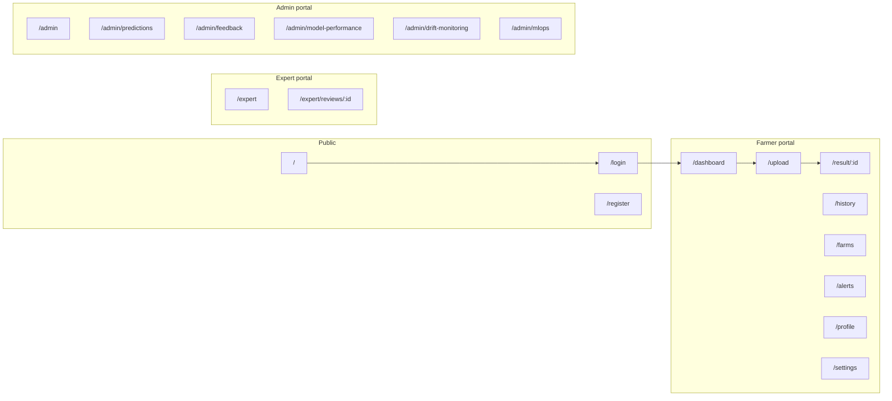

# Screen-spec UI redesign (Stages 13–14)

## Current vs target

Today the web app is a single cream/editorial **ieldnote** shell ([frontend/src/App.tsx](frontend/src/App.tsx), [frontend/src/styles.css](frontend/src/styles.css) plus many override CSS files). Landing is a short hero; `/upload` redirects to `/scan`; farms are one profile form; alerts/expert/admin are mostly static. Flutter is three tabs in [mobile/lib/main.dart](mobile/lib/main.dart).

[Docs/screen_specifications.md](Docs/screen_specifications.md) defines **19 screens** with layouts, copy, and behavior. [Docs/smart_farming_roadmap_stage10_plus.pdf](Docs/smart_farming_roadmap_stage10_plus.pdf) Stage 13–14 is the delivery surface: React (Vite) + Flutter consuming Stage 10 APIs, with Grad-CAM on results, i18n, camera-first mobile, and offline queue.

You chose **UI plus minimal live APIs** (not placeholder-only).

## Visual direction (unique, spec-aligned)

Specs ask for agricultural green, 16–20px cards, 48–52px inputs, light green-tinted backgrounds — **not** a generic farm SaaS clone and **not** the current journal look.

**Concept: Chlorophyll instrument** — a field diagnostic tool. Three related palettes so farmer / expert / admin never feel like the same dashboard with a different sidebar:

- **Farmer:** canopy green (`#0F3D2E`), chlorophyll lime CTA (`#C8E06A`), soil parchment canvas, umber text. Leaf-vein motif and a “scan ring” as signature, not stock illustrations.
- **Expert:** cooler sage-slate, denser tables, clinical case chrome (HITL, not farm summary).
- **Admin:** graphite + amber signals, charts-first ops.

**Type:** Fraunces (crop names / display) + Figtree (UI). Keep EN/HI/GU dictionaries in [frontend/src/i18n](frontend/src/i18n).

**Implementation:** one token file (`frontend/src/styles/tokens.css`) and role-scoped shells. Collapse the current override CSS stack into tokens + layout + page CSS so visual consistency is enforceable.

## Frontend architecture

- Split shells: `FarmerShell`, `ExpertShell`, `AdminShell` (sidebar + topbar per spec). Public routes render without the farmer welcome banner currently hardcoded in `App.tsx`.
- Align routes with the spec (keep `/scan` as alias of `/upload`):

| Spec                                                                                                                     | Action                                                                                                                                                                        |
| ------------------------------------------------------------------------------------------------------------------------ | ----------------------------------------------------------------------------------------------------------------------------------------------------------------------------- |
| `/` landing                                                                                                              | Full 7–9 section page (navbar, hero + floating result card, trust strip, how-it-works, explainability, recommendations, farm context, responsible AI, languages, CTA, footer) |
| `/login` `/register`                                                                                                     | Two-panel identity + form; register fields: name, phone, location, language, password                                                                                         |
| `/dashboard`                                                                                                             | Farm overview stats, weather, scan CTA, recent diagnoses — **not** a full result page                                                                                         |
| `/upload`                                                                                                                | Drag-drop, preview, quality hints, plot picker, Analyze Crop                                                                                                                  |
| Processing                                                                                                               | Overlay/state on upload (keep `/scan/processing/:id` for refresh); live `status` from pipeline                                                                                |
| `/result/:id`                                                                                                            | Centerpiece: image + Grad-CAM, crop/disease/severity/pests, confidence, recommendation, weather context, feedback, expert-pending treatment hide                              |
| `/history`                                                                                                               | Filters + desktop table / mobile cards + simple trend                                                                                                                         |
| `/farms` (+ plot detail)                                                                                                 | Farm → plot → crop → diagnoses                                                                                                                                                |
| `/alerts` (+ `/:alertId`)                                                                                                | Actionable cards, not an inbox                                                                                                                                                |
| `/profile` vs `/settings`                                                                                                | Identity vs app behavior                                                                                                                                                      |
| `/expert`, `/expert/reviews/:reviewId`                                                                                   | Queue + 3-zone case review                                                                                                                                                    |
| `/admin`, `/admin/predictions`, `/admin/feedback`, `/admin/model-performance`, `/admin/drift-monitoring`, `/admin/mlops` | Spec layouts; metrics from real logs where possible                                                                                                                           |

Shared components to extract/rebuild: `AppSidebar`, `UploadDropzone`, `PipelineProgress`, `SeverityGauge`, `GradCamOverlay`, `RecommendationPanel`, `HistoryTable`, `PlotCard`, `AlertCard`, `ExpertQueueTable`.

## Minimal backend (live screens)

Extend [backend/database/models.py](backend/database/models.py) without turning this into Stage 16 full MLOps:

- **Plots:** `plots` (farm_id, name, crop, area, status). Drop unique-one-farm-only if a user needs multiple farms; keep one farm + many plots as the default (matches current 1:1 farm).
- **Plot on predict:** optional `plot_id` on `POST /predict` and `predictions.plot_id`.
- **Alerts:** persist or derive: disease/high-severity scans, weather-risk from existing `/weather`, expert-review pending. `GET /alerts`, `GET /alerts/{id}`, mark-read.
- **Expert:** `expert_reviews` (prediction_id, status, decision, farmer_guidance, internal_note). Queue = low-confidence / `pending_expert_review`. `GET /expert/queue`, `POST /expert/reviews/{id}`.
- **Admin:** implement `GET /admin/metrics` from predictions + feedback (volume, confidence buckets, accuracy from `feedback.is_correct`) instead of 501. Lightweight `GET /admin/feedback` list. Model-performance / drift / mlops: compute class mix, confidence histograms, quality_score vs baseline from logged images; retraining remains a **logged stub job** as the Stage 16 roadmap describes.

Keep existing JWT, `/predict`, `/history`, `/feedback`, `/auth/*`.

## Flutter (Stage 14)

Rebuild [mobile/lib](mobile/lib) as separate screens matching the roadmap table, sharing the farmer palette:

Splash/onboarding → login/register → home → camera (existing [camera_guide_overlay.dart](mobile/lib/widgets/camera_guide_overlay.dart)) → processing → result (TTS) → history (offline vs synced) → farm/plots → alerts → profile → settings.

Keep [sync_service.dart](mobile/lib/services/sync_service.dart) offline queue; expand `api_service.dart` to the same contracts as web. Expert/admin stay **web-only**.

## Build order (so the app stays usable)

1. Tokens + three shells + route map (no visual orphan pages).
2. Public + diagnosis loop: landing, auth, dashboard, upload, processing, result (highest spec + roadmap priority).
3. History, farms/plots + backend plots, alerts + backend alerts, profile/settings.
4. Expert queue + review case + expert API.
5. Admin suite + metrics endpoints.
6. Flutter farmer screens + shared API.

Verification: web flows in the browser (landing → register/login → scan → result → history → farms → alerts; expert and admin with role accounts). Mobile: camera/offline paths via Flutter run or widget tests if a device is not attached.
